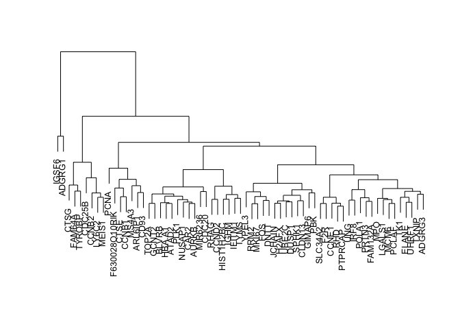
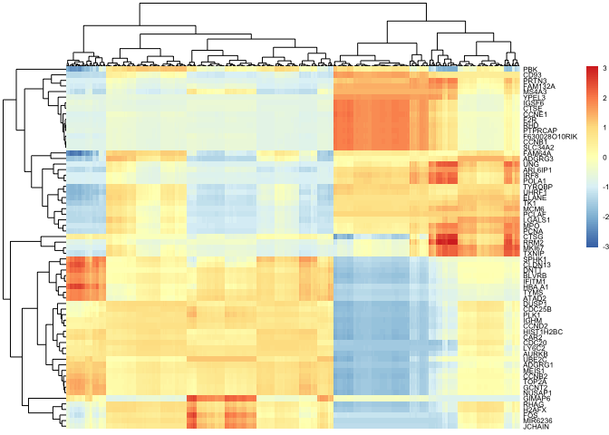

<!-- README.md is generated from README.Rmd. Please edit that file -->

circletime
==========

<!-- badges: start -->
<!-- badges: end -->

The goal of circletime is to provide tools to model and analyze cyclical
biological processes via single-cell RNAseq analysis. To do this,
circletime provides a series of tools to generate cyclical pseudotemoral
ordering, visualization, and identification of genes associated with
progression through the cyclical process.

Installation
------------

You can install circletime from [GitHub](https://github.com/) with:

    # install.packages("devtools")
    devtools::install_github("arc85/circletime")

Pseudotemporal ordering of a cyclical process
---------------------------------------------

Here, we demonstrate how to generate a cyclical pseudotemporal ordering
and to apply that ordering to our low-dimensional embedded data. We are
going to utilize two principal components here for simplicity, but this
methodology can be applied to other embeddings that meaningful preserve
high-dimensional distances (e.g. diffusion maps or UMAPs).

The single-cell expression data used for this demonstration are derived
from [Nestorowa et al, Blood
2016](https://pubmed.ncbi.nlm.nih.gov/27365425/). Usage of this dataset
was inspired by the Seurat vignette for regressing out cell cycle
effects, linked
[here](https://satijalab.org/seurat/v3.2/cell_cycle_vignette.html).
Please see also the R files in data-raw (or eventually the pkgdown
vignette) for a full description of the pre-processing.

Order cells through cyclical process
------------------------------------

    library(circletime)
    library(ggplot2)

    #Visualize embedding
    ggplot(cycle.small,aes(x=PC_1,y=PC_3,colour=clusters)) +
        geom_point() +
        theme_bw()

    #Calculate pseudotime for all cells
    small.pseudotime <- calc_pseudotime(embedding=cycle.small[,c(1,3)],clusters=cycle.small$clusters)

    head(small.pseudotime)
    #>          cell_order pseudotime
    #> Prog_013        250  59.493504
    #> Prog_019        748  17.876051
    #> Prog_031        610  39.393329
    #> Prog_037        341  11.759658
    #> Prog_008        735   4.939973
    #> Prog_014        135  16.084062

    #Combine data and visualize pseudotime
    cycle.small.pseudotime <- cbind(cycle.small,small.pseudotime)

    ggplot(cycle.small.pseudotime,aes(x=PC_1,y=PC_3,colour=pseudotime)) +
        geom_point() +
        theme_bw()

Map progression through pseudotime
----------------------------------

It can be useful to visualize the progression through the cyclical
process. We demonstrate here how to easily do this using
`order_clusters_by_time`.

    temporal.ordered.clusters <- order_clusters_by_time(embedding=cycle.small.pseudotime[,c(1,3)],clusters=cycle.small.pseudotime$clusters,pseudotime=cycle.small.pseudotime$pseudotime)

    #Convert previous clusters to temporally ordered clusters
    level.key <- temporal.ordered.clusters$new_cluster_id
    names(level.key) <- temporal.ordered.clusters$clusters

    cycle.small.pseudotime$ordered.clusters <- dplyr::recode(cycle.small.pseudotime$clusters,!!!level.key)

    cycle.small.pseudotime$ordered.clusters <- as.factor(cycle.small.pseudotime$ordered.clusters)

    #Visualize progression
    ggplot() +
        geom_point(data=cycle.small.pseudotime,aes(x=PC_1,y=PC_3,colour=ordered.clusters)) +
      geom_point(data=temporal.ordered.clusters,aes(x=PC_1_mean,y=PC_3_mean),size=2) +
      geom_path(data=temporal.ordered.clusters,aes(x=PC_1_mean,y=PC_3_mean)) +
        theme_bw()

Identify genes associated with cyclical process
-----------------------------------------------

We can use generalized additive models to evaluate whether genes are
temporally associated with the pseudotemporal process.

    temporal.genes <- genes_over_time(expr.matrix=genes.small,pseudotime=cycle.small.pseudotime$pseudotime)
    #> Loading required package: Matrix

    #View names of output list
    names(temporal.genes)
    #> [1] "expression_fits" "p_values"
    names(temporal.genes[[1]])[1:10]
    #>  [1] "CCNB2"         "HIST1H2BC"     "CTSG"          "ELANE"        
    #>  [5] "MPO"           "F630028O10RIK" "IGSF6"         "PRTN3"        
    #>  [9] "MS4A3"         "LY6C2"

    #Bind fit modules into data.frame
    fits.frame <- t(do.call(rbind,temporal.genes[[1]]))
    fits.frame <- data.frame(fits.frame)

    #View genes by temporal dynamics
    par(cex=2)
    plot(hclust(dist(t(fits.frame))),xlab="",ylab="",main="",sub="",axes=FALSE)

    pheatmap::pheatmap(t(fits.frame),scale="row",show_colnames=FALSE,fontsize=6)

    #Add pseudotime to data.frame
    fits.frame.time <- fits.frame
    fits.frame.time$pseudotime <- cycle.small.pseudotime$pseudotime

    #Order gene expression by pseudotime
    fits.frames.dynamics <- fits.frame.time[,c("PBK","TXNIP","CLDN13","pseudotime")]
    fits.frames.dynamics <- fits.frames.dynamics[order(fits.frames.dynamics$pseudotime),]

    #Remove pseudotime and melt for plotting
    fits.frames.dynamics <- fits.frames.dynamics[,-which(colnames(fits.frames.dynamics)=="pseudotime")]
    fits.frames.dynamics <- apply(fits.frames.dynamics,2,scale)
    fits.frames.dynamics <- reshape2::melt(fits.frames.dynamics)

    colnames(fits.frames.dynamics) <- c("Pseudotime","Gene","Expression")

    #Visuale gene dynamics over time
    ggplot(fits.frames.dynamics,aes(x=Pseudotime,y=Expression,group=Gene,colour=Gene)) +
      geom_line(size=2) +
      theme_bw()

